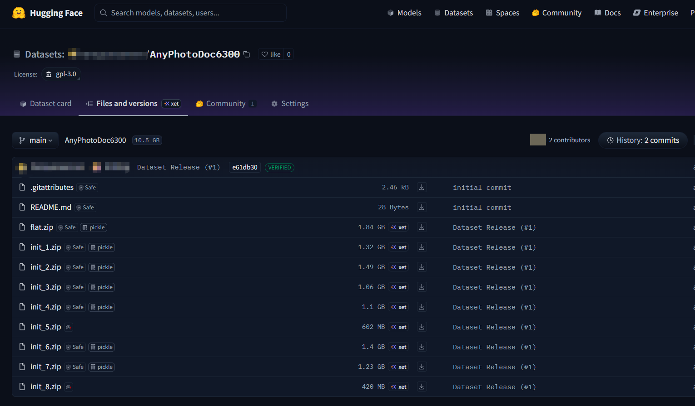

## DvD: Unleashing a Generative Paradigm for Document Dewarping via Coordinates-based Diffusion Model (under approval) 


### Quick Start
Before running the script, install the following dependencies:

```shell
pip install -r requirements.txt
```

### Download link of AnyPhotoDoc6300 benchmark dataset 

Google Drive (A sample subset link for review) 
  
https://drive.google.com/drive/folders/1NJZtaTh4erKFcXDcs1t1JyF2hc1EBOA3?usp=drive_link

The full dataset had been uploaded to HuggingFace. Since the anonymity policy, we have not yet made the link public. 
Here, we just showcase its snapshot.

  


### How to play
To run the DVD model as shown above:

#### Download link of Pretrained DvD model 
https://drive.google.com/drive/folders/1RBt9t_5igAlN1BlQAkVLwJ_rZXITy_pN?usp=sharing


#### Inference code
```bash
python run_sampling.py \
  --train_module 'dvd' 
  --train_name 'val_TDiff' --name "0918"
```

#### Training code
```bash
mpiexec -n 1 python run_training.py \  
  --train_module 'dvd' 
  --train_name 'train_TDiff' 
```

